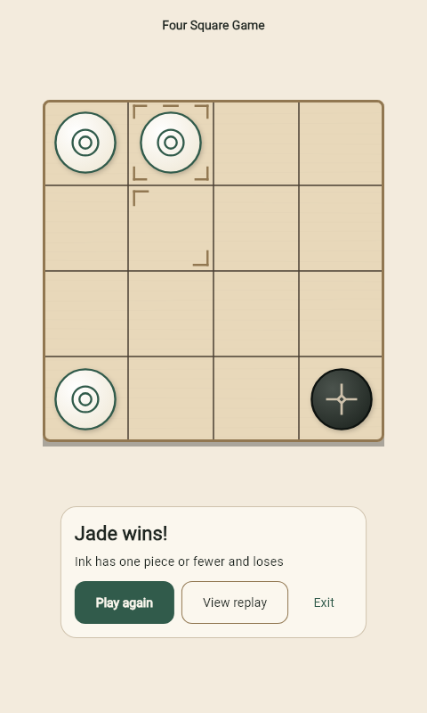

# 棋局展示与触觉优化（2026-10-03）

基线 `5b29fd7`（PR #9 已合并），分支 `codex/gameplay-feedback`。

## 改动

- 普通 PVP/PVE 终局采用信息区结果卡片，最后一步的棋盘展示完成后才出现。保留本地化胜负原因、再来一局、回放及退出，终局维持相同棋盘朝向。
- 现代东方主题落子 320ms，落子完成后播放 680ms 吃子强调/消失，再保留 150ms 观察间隔。显示时长和曲线由主题传入实际控制器。
- 展示层按对局标识和步数处理快速连续状态。AI 计算和规则计时保持原样，展示中的棋盘临时不接收点击；复局、撤销、减少动态或退出会清理旧展示。触屏和语义层使用同一个正在展示的棋盘。
- 触觉由实际状态变化触发：选子 selectionClick、普通落子 lightImpact、吃子 mediumImpact。双吃一次、重复渲染不重触发；关闭动画保留触觉，关闭触觉开关保持静默。

## 验证

新增回归先复现：无动画时缺少选子/落子触觉、落子未完成被吃棋子已经淡出、快速回应覆盖前一步、终局自动弹窗覆盖棋盘。

全量 Flutter：892 通过、1 项显式 Online 跳过、0 失败。新增 11 项覆盖捕获顺序、触觉次数/开关、连续展示及四类取消、真实引擎获胜局面通过真实页面呈现、320px 两倍文字与横屏终局。既有规则、音频和持久化回归保持通过。

实际触觉强度和舒适性依赖手机及系统触觉设置，需要 v7 真机复测。LAN/Online 继续使用其各自终局页面，未对其终局交互声称完成。SDK、依赖和规则未变更。

## 页面预览

以下为真实 `GamePageView` 在 Widget 渲染环境中的终局截图，输入由真实引擎获胜结果生成。字体使用本机已有 Roboto 代替设备字体；本图用于布局检查，不代表 Android 实机录屏。

