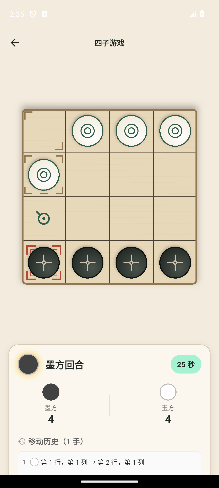
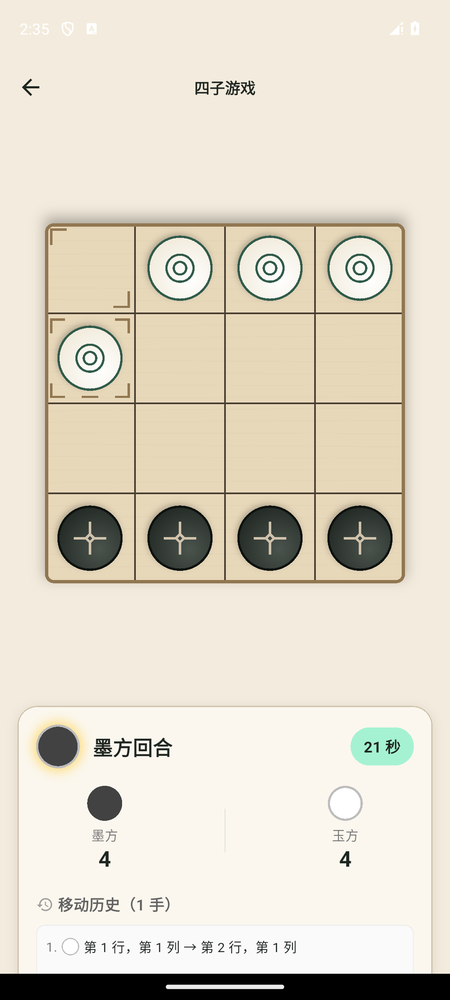

# 多批自动加固执行记录（2026-10-02）

> 基线 `origin/main` / `8ee437f`，PR #6 已合并；分支 `codex/automatic-hardening-batches`。按 A1–A4 处理当前明确队列，缺少设备/环境/资料的项目单列门禁，无依赖或大型环境安装。

## 批次 1：AI 验证与循环诊断

- 新增 16 个七手强制获胜场景，双方执色及 8 种几何对称均通过独立全宽胜负 oracle。
- 基准增加最大位置访问数、最短重复间隔和终局未吃计数，旧 JSON 字段保持。键为棋盘加行棋方，与棋子列表顺序无关；循环不提前判和。
- 真实引擎执行两轮合法 4 ply 往返，未吃 8、位置重复而对局继续。
- 新种子 `20261030` 共 60 局，全部合法、自然终局、无搜索超时：中等/简单20胜0负0和，困难/简单20胜0负0和，困难/中等10胜2负8和。和棋最短循环4/16 ply，位置最多出现11次，仍按50 ply结算。
- AI 深度/预算/规则保持本轮基线，诊断不推导普遍棋力保证。

## 批次 2：生命周期与持久化

复现后修复：旧存档读取覆盖新局、旧读取解除暂停并重置时间、初始载入尚未完成进入后台后启动活动计时、旧开局/复局初始化覆盖新模式。

载入以活动代次校验，启动请求另有独立代次并在删除/初始化返回后校验；关闭和有效载入使旧初始化失效。页面使后台恢复出的离线状态立即暂停，LAN/Online边界保持。

组合验证：真实引擎/BLoC/Hive、最新局后续落子、迟到成功归档保留新存档、真实吃子后撤销重做及再载入的状态/标记一致。保留失败终局补记、21局/20历史及PVE实际执色等既有验收。

存档版本1/2及归档接口保持。这些场景不替代真实低存储、文件系统损坏及所有重试策略的设备验收。

## 批次 3：UI、动效和无障碍

- 空闲棋盘不再持续运行选中呼吸 ticker；选中时 painter 真实逐帧重绘。取消选中/关闭动效停止，关闭清理移动/吃子控制器和旧反馈代次。
- 有历史的续局停止重播“即将开始”；异步准备好的零步PVP按真实先手每局提示一次。同局选子不重复，复局按新ID/先手提示，旧回调不移除新提示。
- 系统减少动态效果时信息静态展示，保留同一展示期限；偏好切换不重置截止，销毁取消，完成一次。普通对局计时合同保持。
- 难度说明校准为已有界面的深入计算能力；评分注释明确正分对应传入player，执行评分算法保持。

## 批次 4：文档与最终候选

[执行队列](../../NEXT_STEPS_20261002.md)、测试策略和脚本字段说明同步，历史报告保留。

- 全量 Flutter：863 通过、1 项显式 Online 默认跳过、0 失败；新增33项验收场景。
- `flutter analyze --no-pub`：No issues found；Dart 格式201文件、0改动。
- 现有依赖 Node 测试125通过，真实双 Flutter/Node 传输1通过。源文件与原工作区 `75d24d5` 比较提交及磁盘归一化哈希一致；仅使用已有生成缓存，过程清空DB/Redis URL并绕过回环代理，不读取 `.env.staging`。首次 CLI 参数格式错误退出64，修正为独立 `--timeout 60s --reporter expanded` 后完整通过，未计作产品失败。
- 专用 API34、普通 Debug v4：已稳定保存的 PVP 检查点→HOME/force-stop/继续，16格占位、当前方、历史坐标和起终点标记一致；选中/取消/再次合法落子通过；显式困难 PVE 玩家与AI回应通过。5.56秒是包含输入/采集的原生观察窗口，非算法耗时或Release性能。
- Android系统动画设置/UI提示路径及设置恢复通过；减少动态静态渲染由Widget测试证明，原生单张截图/XML未单独证明MediaQuery映射及跨时间不动，该原生层保持部分验证。已补充专用Android平台桥接集成用例并通过针对性静态分析，本轮收口未重新启动AVD执行，因此不把该用例计为运行通过。首次立即强停没有Continue的观察保留；一有界重试等待生命周期保存稳定后通过，不能推导所有瞬间强杀的持久化保证。
- APK SHA-256：`ddf5697e3a1faa0674cc8ee7279678b0808e4a586fcaf7dccae0932df6e59b5c`，versionCode4。源为基线8ee437f及本轮生产差异，后续仅格式规范化，业务实现保持。构建号本地配置已还原。
- 采样日志未出现fatal/ANR；系统三个动画配置、字号、旋转、网络设置精确还原，自有AVD关闭，ADB设备列表为空。两个Luna执行闭环，主代理核对输出、关键XML/截图和还原；该分工不推导未测层通过。

两张精选交互截图提交供UI审核，其余原始截图、日志与APK留本机。

| 选中 | 取消选中 |
|---|---|
|  |  |

证据：`build/hardening-batches-20261002/` 中红绿回归、独立样本、最终日志、设备哈希和清理记录。

## 剩余门禁

更多系统版本、真机性能/长期内存、真实OOM/低存储、双设备LAN、正式签名升级；隔离PostgreSQL、TLS、重启/负载、备份及匿名数据删除；iOS/语音真机与外部引擎；产品身份、隐私/商店/签名资料、首次渠道Online范围和运营外部输入。

本机Docker引擎未运行，外部环境项未计为通过。正式可发布状态由独立门禁决定；验证后统一PR，人工审核合并。原工作区四项用户改动保持原状。
