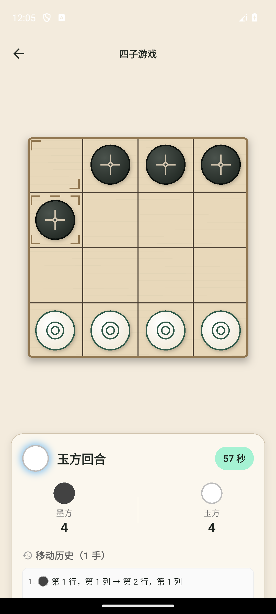

# 续局体验与 AI 优化（2026-10-02）

> 开发分支 `codex/resume-and-ai-refinement`，基线 `origin/main` / `29052e8`，PR #5 已合并。本轮范围：续局高亮及有证据支持的困难 AI 搜索优化；后续执行队列见 [NEXT_STEPS_20261002.md](../../NEXT_STEPS_20261002.md)。

## 1. 续局标记

真实 Hive 重开失败回归复现：存档已保留历史最后一步，恢复的 `GamePlaying.lastMove` 为 null，UI 缺少起终点标记。按已有撤销/重做路径的写法，载入时直接从历史最后一步恢复 `lastMove`，活动与失败终局恢复共用此规则。

- 活动棋局：最后一步及完整吃子列表保留；棋盘、历史和未吃计数保持一致。
- 空历史：标记为空。
- 终局写入失败后的补记：保留最后一步、原完成时间及 ID，不重复统计。
- 真实 `GamePageView` 消费恢复状态，语义棋盘提供“上一手起点/终点”。测试仅替换系统音频端口，使用真实 BLoC/引擎/Hive。
- 存档版本 1/2 及字段保持不变，不创建新迁移。

页面测试接入时修正两处测试生命周期：真实异步读盘及 BLoC 创建置于 `runAsync`，语义句柄在测试正文结束前释放；未修改生产页面行为来适配测试。

## 2. 搜索效率与棋力

- 中等/困难根节点使用当前最佳分数作为 alpha；比已知最佳更差的候选可以提前终止。简单档需要完整逐候选分数来随机排名，保持原有完整窗口。
- 同一初始局面、固定 6 层对比：4203→2996 个评估节点，走法和评分一致。固定 3600 次截止检查的模拟工作预算，旧路径仅完成 5 层，新路径完成 6 层并与独立全宽 oracle 评分一致。该对比限定同深度，不代表提高目标深度后总耗时下降。
- 困难基础深度 6→8；低子数动态加深规则保留。简单/中等为 2/4，时间上限为 100/500/1800 ms；超时继续回退到最后完整迭代，原生后台 isolate 路径保持不变。
- 可达战术反例 `.B../..../WBW./.WW.`，白方行棋、未吃计数 1：旧路径 `(1,3)→(0,3)` 不能保证 7 ply 内获胜；新路径 `(0,2)→(0,1)` 由独立全宽胜负 oracle 验证 7 ply 内强制获胜。此测试先失败后通过。
- 保留同深度精确缓存契约：冷/热缓存与独立全宽搜索一致。通过注入截止时间保留原 6 层缓存反例，同时默认难度测试验证实际完成 2/4/8。

## 3. 难度样本

双执色、双先手、每回合新建 AI；落子通过权威引擎，保持 50 ply 规则。使用 20261002 开发样本和不重叠的 20261016 留出种子区间。

| 样本 | 配对 | 旧 6 层胜/负/和 | 新 8 层胜/负/和 |
|---|---|---|---|
| 20261002 | 困难 / 中等 | 9 / 8 / 3（上一轮相同样本） | 9 / 2 / 9 |
| 20261016 留出 | 困难 / 中等 | 10 / 8 / 2 | 10 / 2 / 8 |
| 20261016 留出 | 困难 / 简单 | 20 / 0 / 0 | 20 / 0 / 0 |
| 20261016 留出 | 中等 / 简单 | 20 / 0 / 0 | 20 / 0 / 0 |

留出样本中胜局数保持，败局减少、和棋增加。困难/中等平均搜索落子从 31.05 增为 36.1，最长均为 63；困难/简单平均从 18.2 减为 16.9。新留出采样的困难单次搜索最大 492.408 ms，未发生搜索超时。所有数字来自本机开发样本，继续保留真机 Profile/Release 门禁及更多局面/人工体验调优；有限样本不构成普遍棋力或性能保证。

本轮执行临时实验/旧留出/候选留出各 60 局，最终代码的开发及留出样本共 120 局，合计 300 局；全部落子合法、自然终局、无搜索超时。最终开发样本的最大单次搜索 852.897 ms，运行时同机有构建/分析任务，计时作为开发采样保留，不转为正式性能门禁。

证据：`build/refinement-20261002/` 中的红绿回归、搜索探针、临时 8 层实验、留出旧/新样本和最终生产代码样本。临时实验源转为 `.dart.txt` 留存，不扩展项目 lint 忽略范围。

## 4. 最终验证

- 全量 Flutter：830 通过、1 项按设计默认跳过、0 失败。
- `flutter analyze --no-pub`：No issues found。
- 格式：198 文件，0 改动。
- 专用 API 34、普通 Debug v3：PVP 落子→HOME 暂停→force-stop→继续通过，16 格、行棋方、历史坐标及上一手起终点语义标记一致；主代理独立解析前后 XML 并核对恢复截图。
- 困难 PVE：显式选择“困难 / 更深入地计算局面”，墨方玩家完成合法移动，玉方 AI 回应后历史为 2 手。原生 UI 观测窗口 6.76 秒，包括输入和状态采集；该数字不等同内部搜索耗时或 Release 性能门禁，设备场景未单独证明实际完成 8 层。
- APK SHA-256：`cb61c321759579f398347b29f826e63c53066139079fa3516eec56f0f5d100f9`，versionCode 3；源基线 `29052e8` 加本轮生产 diff。构建之后生产源保持不变，自动生成的本地版本号配置已还原。
- 采集窗口无 fatal/ANR；字体、旋转与网络设置未改变，自有 AVD 关闭，`adb devices -l` 为空。Luna 执行原生测试，主代理负责范围与关键证据验收；精确步骤数未计量。
- 服务端与 Online 代码未改动，上轮相同源文件的 125 项 Node 和 1 项本地真实传输证据保留为未受影响路径，不计作本轮重新执行。

恢复前后的两张精选截图提交供 UI 审核，其余原始证据/日志/APK 保留 `build/refinement-20261002/android/`。

| 保存点 | 继续游戏后 |
|---|---|
|  |  |

## 5. 剩余门禁

- 更丰富 AI 战术集、重复局面原因和人工难度体验。
- 真机性能/内存、更多 Android 版本、双设备 LAN、正式签名及升级。
- 真实数据库、TLS、负载、备份恢复、匿名数据删除、商店及语音平台验收。
- 一期主题、Online 默认入口和发布阶段保持现有边界。

本分支验证后提交 PR，人工审核合并；原工作区用户改动保持原状。
